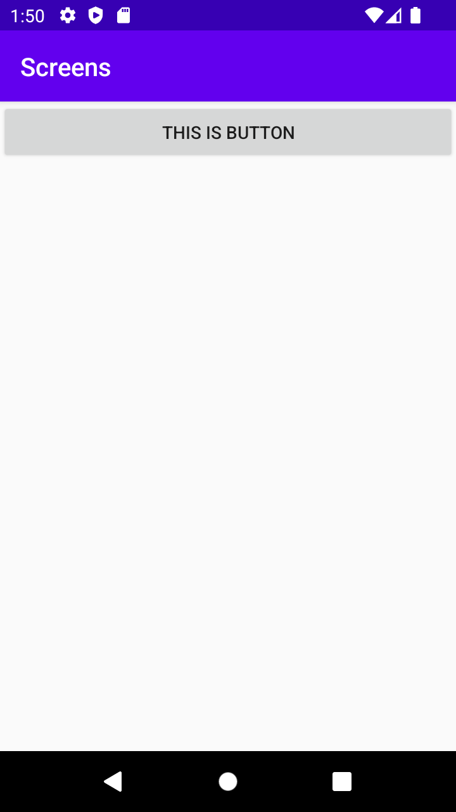
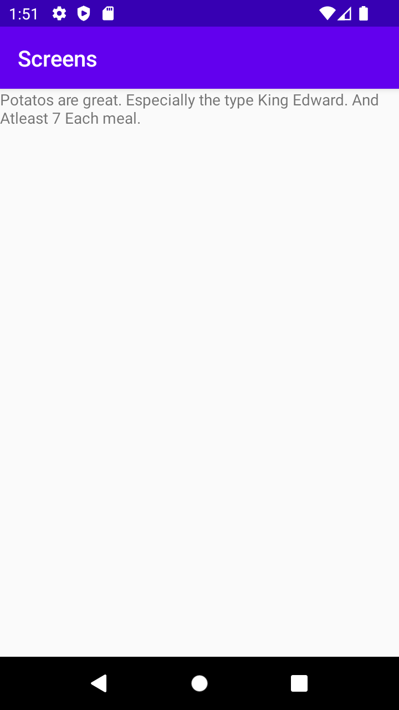

# Rapport
Skapade en ytterligare aktivitet genom new -> Activity -> Empty Views Activity, och döpte den till ExtraActivity.
Detta betyder även att en activity_extra.xml skapas, som vi kan använda för att sätta in widgets (etc) i activityn. En TextView vid namn ExtrasTextView
skapas, som innehåller en text som vi i senare skeden ska manipulera.    
```
<TextView
...
...
android:text="This is a test"
...
android:id="@+id/ExtrasTextView"/>
```
En knapp lades till i activity_main som är start-scenen. Denna används för att starta den andra aktivitieten (Extra Activity)
i ett senare skede. Jag gav även knappen ett ID, för att kunna nå den.
```
<Button
        android:layout_width="match_parent"
        android:id="@+id/ExtraActivityButton"
        ...
        />
```
För att kunna använda knappen, satte jag en onClickListener som därmed kör kod när knappen trycks på, notera att ID från tidigare skapad knapp finns med. 
I listenern lägger jag till att den ska skapa en ny intent, där intenten skapas i MainActivity, och "går till/leder till/är dirrigerad till" ExtraActivity classen. StartActivity(intent)
innebär alltså att intenten startas (och igentligen skapas, via tidigare kodrader) vid knapptrycket.
```
ExtraActivityButton.setOnClickListener(new View.OnClickListener() {
@Override
public void onClick(View view) {

                Intent intent = new Intent(MainActivity.this, ExtraActivity.class);
                ...
                ...
                startActivity(intent);
            }
        });
```
Genom intent.putExtra signaleras vilken del som ska ändras på, vilket i detta fallet är potatoType, och anyNumber. Genom intent.putExtra sätts 
bland annat potatis typen "King Edward" in, i potatoType. Även any number får en 7:a. Dessa manipulerar data som finns i ExtraActivity.java.
```
ExtraActivityButton.setOnClickListener(new View.OnClickListener() {
@Override
public void onClick(View view) {

                ...
                intent.putExtra("potatoType", "King Edward"); // Optional
                intent.putExtra("anyNumber", 7); // Optional
                ...
            }
        });
```
Inom ExtraActivity.java skapas ett Bundle objekt, som sedan "ges" intenten som vi skapat, skickar med datan, Extras, som vi skickat med intentet.
Denna data kan synas i kodraden ovanför. Notera att vi sätter type och number till det värdet som vi angett i intent.putExtra. 
Exempelvis: potatoType, som innehåller "King Edward". Notera att vi skapar en referens till ExtrasTextView, som baseras på vår egenskapade TextView i activity_extra.
Denna ändrar vi texten på, där de "extras" som skapats finns med.
```
Bundle extras = getIntent().getExtras();
if (extras != null) {
String type = extras.getString("potatoType");
int number = extras.getInt("anyNumber");

            TextView ExtrasTextView = findViewById(R.id.ExtrasTextView);
            ExtrasTextView.setText("Potatos are great. Especially the type " + type + ". And Atleast " + number + " Each meal.");

        }
```
Nedan syns start-scenen.


Nedan syns extra-scenen.

